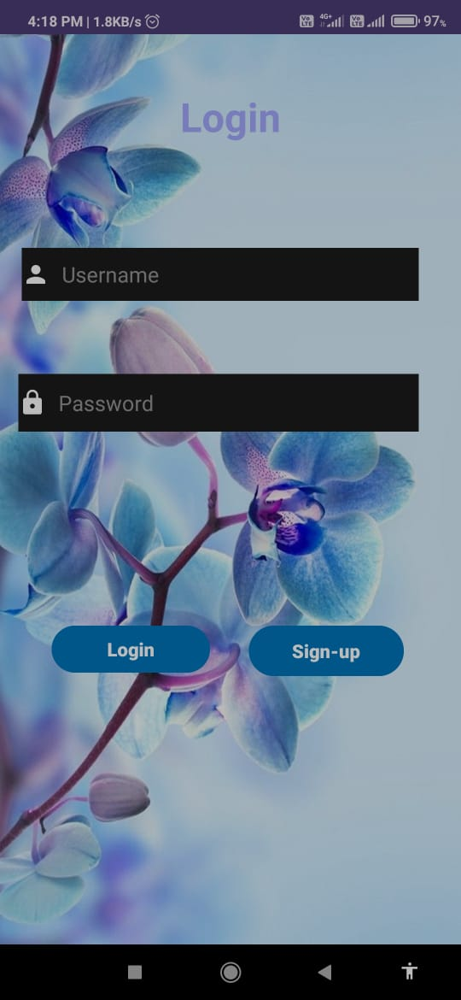
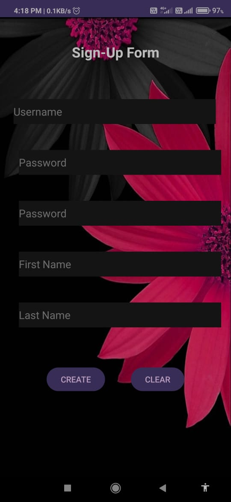
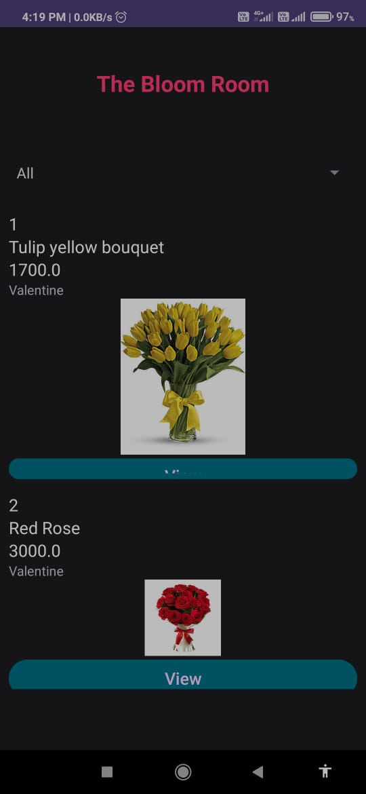
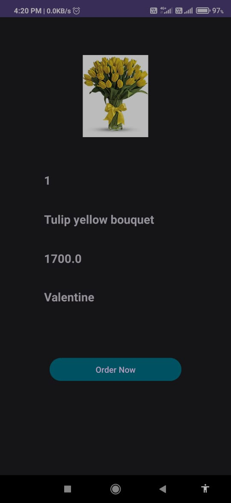
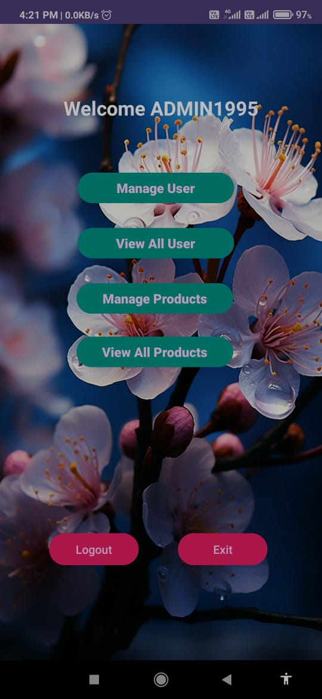
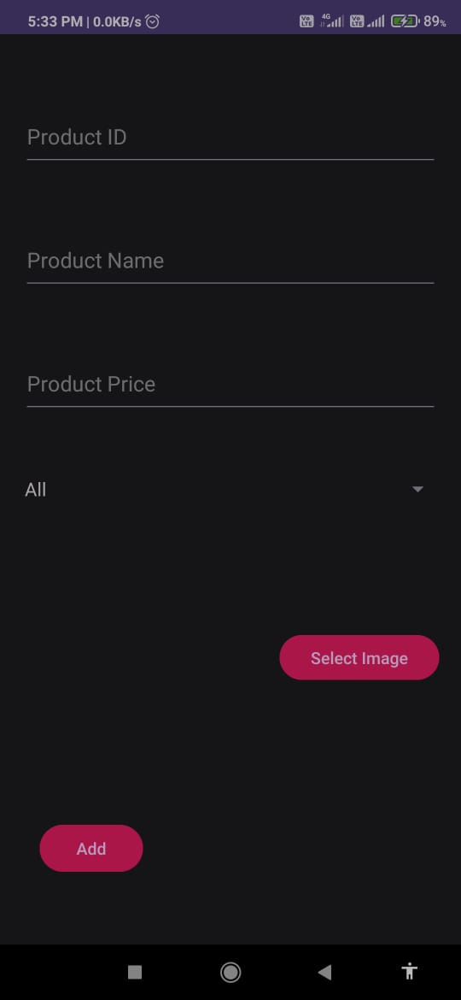
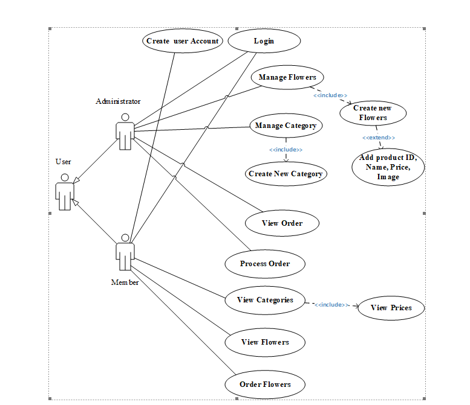
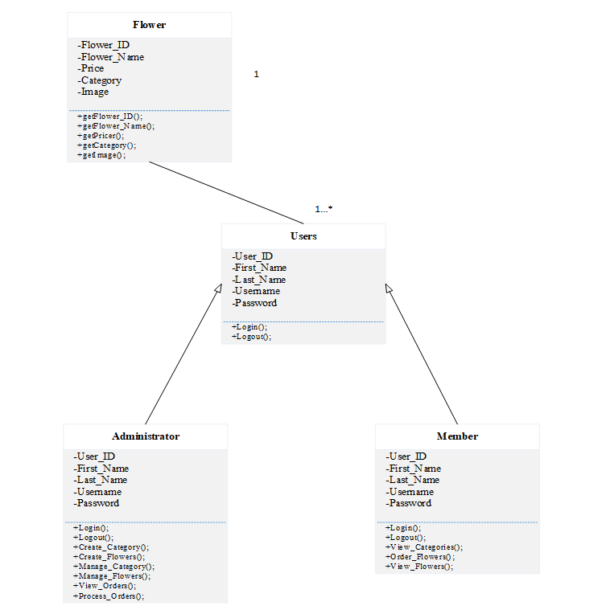

# The Bloom Room Android App

 <!-- You can insert an image of your app here -->

## Description
Uchitha 

## Features
- Login and Signup with validation
- Clean and intuitive UI design
- Browse available flowers with category filtering
- View flower details 
- Admin panel for manage users, view all users, manage products and view all products

## Screenshots
Here are some snapshots of the app:

<!-- Add more screenshots if needed -->

## Project Structure
- **Language**: Java
- **Database**: SQLite
- **Android Studio Version**: Android Studio Flamingo | 2022.2.1 Patch 2
- **Minimum SDK**: 24
- **Target SDK**: 34

## Installation
1. Clone the repository
2. Open the project in Android Studio
3. Build and run the app on an emulator or a physical device

## How to Use
Download the APK from Build app folder

## Diagrams

#### Use case diagram

-- Class diagram

## Contributors
- [Uchitha Kavinda Perera](www.linkedin.com/in/uchitha-kavinda-perera-3047761b4) - Designer and Developer

